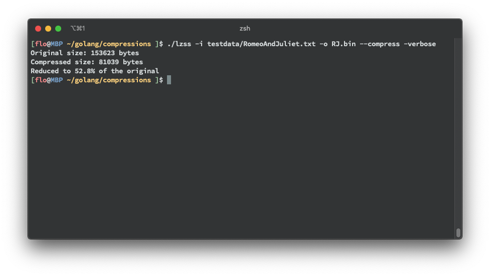

# compressions
Playing with compression algorithms

## LZSS


This implementation uses 12 bit for the lookback and 4 bit for the length.
At the moment it uses sequential search.
Beginning with the 1st byte, every ninth byte is a bit-mask to indicate which 
bytes are values and which bytes are the pointers to previous values.

### Run the code
* Compile the code `go build lzss.go`
* Compress a test file `./lzss -i testdata/RomeoAndJuliet.txt -o RJ.bin --compress --verbose`
* Decompress the file again `./lzss -i RJ.bin -o RJ.txt --decompress --verbose`

All options:
```
Usage: lzss --input INPUT --output OUTPUT [--compress] [--decompress] [--verbose]

Options:
  --input INPUT, -i INPUT
  --output OUTPUT, -o OUTPUT
  --compress, -c
  --decompress, -d
  --verbose, -v
  --help, -h             display this help and exit
```

### Resources
http://wiki.xentax.com/index.php/LZSS
http://michael.dipperstein.com/lzss/ 